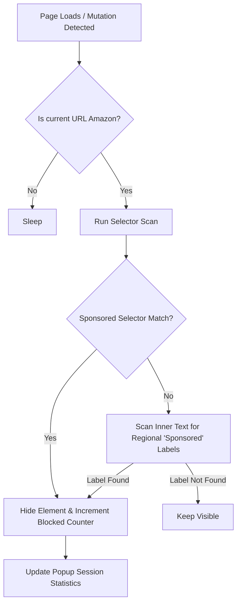

# Product Requirement Document (PRD)
## Amazon Sponsored Product Blocker Extension (v1.0)

---

## 1. Executive Summary

### 1.1 Product Overview
The **Amazon Sponsored Product Blocker** is a lightweight browser extension designed to identify and filter out sponsored search results, banner ads, and video advertisements from Amazon search results pages. By cleaning up the layout, the extension enables users to see purely organic, user-rated, and relevant results, leading to an improved shopping experience, faster decision-making, and reduced cognitive load.

### 1.2 The Problem
Amazon's search results are increasingly dominated by paid placements. "Sponsored" listings frequently mimic organic listings, taking up the top slots on desktop and mobile viewports. 
- **Deceptive Layouts:** Users struggle to distinguish between paid advertisements and organic search results.
- **Visual Clutter:** Banner advertisements, sponsored videos, and carousel ads distract from product comparison.
- **Slower Shopping:** Users waste time clicking on sponsored items that do not match their organic search relevance.

### 1.3 The Goal
Build a Chrome/Chromium-compatible extension (Manifest V3) that automatically, seamlessly, and safely blocks all elements tagged with "Sponsored" labels or matching sponsored identifiers on Amazon without degrading page load times.

---

## 2. Target Audience & Personas

### 2.1 Personas
- **The Efficiency Shopper (Primary):** Wants to compare products based on ratings, prices, and organic relevance quickly. Distracted and frustrated by sponsored listings that push high-rated organic products below the fold.
- **The Privacy-Conscious User:** Prefers to minimize exposure to target tracking and paid placements on shopping platforms.
- **The Less Tech-Savvy Shopper:** Easily mistakes sponsored listings for the "best match" or "highest-rated" product. Benefit from a clean interface where results are strictly organic.

---

## 3. Scope & Out of Scope

### 3.1 In Scope (Version 1.0)
- Support for Chrome and Chromium-based browsers (Brave, Edge, Opera, etc.) using Manifest V3.
- Automatic detection and complete hiding of any block/card containing a "Sponsored" label (e.g., inline grid listings, banners, video containers, carousels).
- Interactive browser popup containing:
  - Simple Master Toggle (On/Off).
  - Statistics counter of blocked elements (session-level and all-time).

### 3.2 Out of Scope
- Support for non-Chromium browsers (like Firefox/Safari) in the initial release.
- Fine-grained feature toggle controls (e.g., custom filters, whitelist domains).
- Cross-device statistics syncing.

---

## 4. Functional Requirements

### 4.1 Sponsored Product Detection and Hiding
| ID | Requirement | Priority | Description |
| :--- | :--- | :--- | :--- |
| **FR-1.1** | **Automated Hiding** | P0 (Critical) | Automatically detect and hide any block/grid item/card that displays a "Sponsored" tag (including the tag itself and its parent product card/row). |
| **FR-1.2** | **Dynamic Scroll Scanning** | P0 (Critical) | Monitor the DOM dynamically (using `MutationObserver`) to hide newly loaded sponsored items when scrolling or changing pages. |
| **FR-1.3** | **Layout Integrity** | P0 (Critical) | Ensure blocking ads does not leave unsightly empty spaces or break the CSS grid layout of organic results. |

### 4.2 Browser Extension Popup UI
| ID | Requirement | Priority | Description |
| :--- | :--- | :--- | :--- |
| **FR-2.1** | **Master Toggle Switch** | P0 (Critical) | A simple On/Off switch in the extension popup to enable or disable blocking globally. |
| **FR-2.2** | **Blocked Counter Dashboard** | P1 (High) | Display the number of blocked sponsored items in the current tab session, along with a historical all-time count. |
| **FR-2.3** | **Badge Count** | P1 (High) | Update the extension icon badge in the toolbar to show the count of blocked ads on the current tab. |

---

## 5. Non-Functional Requirements

### 5.1 Performance and Footprint
- **Page Load Impact:** Inject content scripts asynchronously to avoid slowing down Initial Contentful Paint (ICP).
- **CPU & Memory:** Content script memory utilization must not exceed 25MB per active tab. DOM traversal must be optimized to run only on nodes related to search results.

### 5.2 Security and Privacy
- **Zero Data Collection:** The extension must not collect, store, or transmit search queries, browsing history, user credentials, or personal information. No external analytics SDKs are allowed.
- **Local Execution:** All logic must run locally inside the client browser. No external API requests should be made for classification.

### 5.3 Compatibility
- **Manifest Version:** Must conform to Chrome Extension Manifest V3.
- **Browsers:** Chrome, Brave, Microsoft Edge, Opera.

---

## 6. Technical Architecture & Implementation Strategy

### 6.1 DOM Selection Heuristics
Amazon frequently changes class names to bypass generic ad-blockers. The extension must identify sponsored elements using robust, fallback-equipped selector strategies:
1. **Label Text Scans:** Scan search grid cells and inline lists for elements containing the text "Sponsored" or variations (e.g., looking for the info icon container next to "Sponsored" text).
2. **Selector Targets:** Target parent containers of classes or data attributes associated with ad items (e.g., elements containing `sponsored-label`, `data-component-type="sp-sponsored-result"`, `div[class*="AdHolder"]`).
3. **Parent Traversal:** Once a sponsored label is detected, traverse up the DOM tree to locate the root search container card (e.g., class `s-result-item` or similar layout wrapper) and hide it cleanly (`display: none;`).



### 6.2 Data Flow & Messaging
- **Content Script:** Detects and hides sponsored elements. Emits runtime messages to the background script containing block counts.
- **Background Service Worker:** Receives count updates, increments local stats store (`chrome.storage.local`), and updates the extension's badge number on the browser toolbar.
- **Popup Script:** Queries `chrome.storage.local` to render counts and allows toggle changes which are broadcasted to the active tabs.

---

## 7. Wireframes & UI Concept

The extension popup must look clean, modern, and trustworthy.

```
+------------------------------------------+
|  Amazon Sponsored Blocker          [ O ]  |  <- Extension Icon & Master Toggle
+------------------------------------------+
|                                          |
|         [ 4,218 ] Blocked Ads            |  <- Total All-time Count
|                                          |
|    This Session:  [ 12 ] ads blocked     |  <- Tab Session Count
|    Current Tab:   amazon.com             |  <- Status indicator
|                                          |
+------------------------------------------+
```
