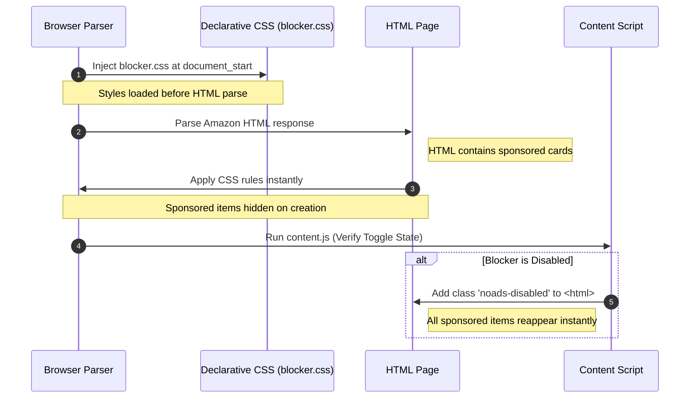

# Product Requirement Document (PRD) Addendum
## Zero-Flicker Ad Blocker Optimization (v1.1)

---

## 1. Introduction & Objective

### 1.1 Objective
Eliminate the visual flicker (the "Flash of Unstyled Ads") where sponsored product cards, banners, and carousels are visible to the user for 1 to 3 seconds before being hidden by the extension content script.

### 1.2 The Problem
Currently, the blocker script runs at `document_idle`. At this lifecycle stage:
1. The browser has fetched the HTML, constructed the DOM, downloaded styles, and painted the sponsored listings to the screen.
2. The user sees the ads and begins scanning.
3. The content script loads, executes, traverses the DOM, and hides the elements.
4. The page layout shifts suddenly, creating a jarring user experience and causing high Cumulative Layout Shift (CLS).

---

## 2. Technical Performance Analysis

| Metric | Current Behaviour (v1.0) | Proposed Zero-Flicker (v1.1) | Impact |
| :--- | :--- | :--- | :--- |
| **Execution Timing** | `document_idle` (Post-Render) | `document_start` (Pre-Render) | 100% earlier execution |
| **Sponsored Visibility Time** | 1.5s - 4.0s (Network dependent) | **0 milliseconds** | Complete elimination |
| **Cumulative Layout Shift (CLS)** | High (Jarring layout collapse) | Zero (Ads hidden before layout paint) | Smooth reading experience |
| **CPU Overhead** | Layout recalculations on hide | Native rendering exclusion | Lower CPU overhead |

---

## 3. Proposed Solution Architecture

To block ads with zero delay, we must transition from **imperative dynamic hiding (via JS)** to **declarative rendering exclusion (via native CSS injection)**.



### 3.1 Declarative CSS Injection (`manifest.json`)
We will move the blocker CSS rules into a static stylesheet file (`styles/blocker.css`) and register it in `manifest.json` under `content_scripts.css`. 
By declaring CSS directly in the manifest, the browser’s C++ engine injects the stylesheet at `document_start` before parsing any HTML body content.

### 3.2 HTML Root Selector Condition
To ensure that turning the blocker "OFF" from the popup still works instantly, we prefix all blocker rules with `:root:not(.noads-disabled)`.
For example:
```css
:root:not(.noads-disabled) div.s-result-item:has(.puis-sponsored-label-text) {
  display: none !important;
}
```
- **Blocker ON (Default):** The class `.noads-disabled` is absent, so rules match and sponsored elements are never rendered.
- **Blocker OFF:** The content script adds `.noads-disabled` to the root HTML element, disabling the selector rules and causing the ads to appear instantly.

---

## 4. Functional Requirements & Changes

### 4.1 Manifest Setup
- Register `styles/blocker.css` under the `css` array in `manifest.json`.
- Change `run_at` to `document_start`.

### 4.2 Content Script Setup
- Execute script at `document_start`.
- Immediately check `chrome.storage.local`. If `enabled` is false, add `noads-disabled` class to the `<html>` element.
- Since we run at `document_start`, the `body` is not ready, but `document.documentElement` (`<html>`) is always available.
